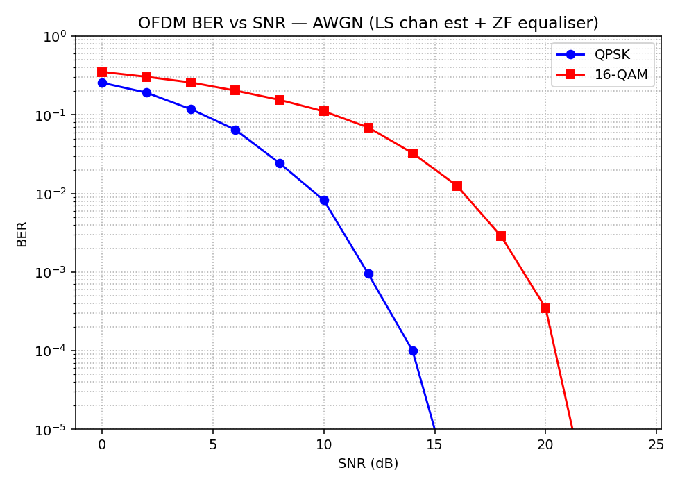
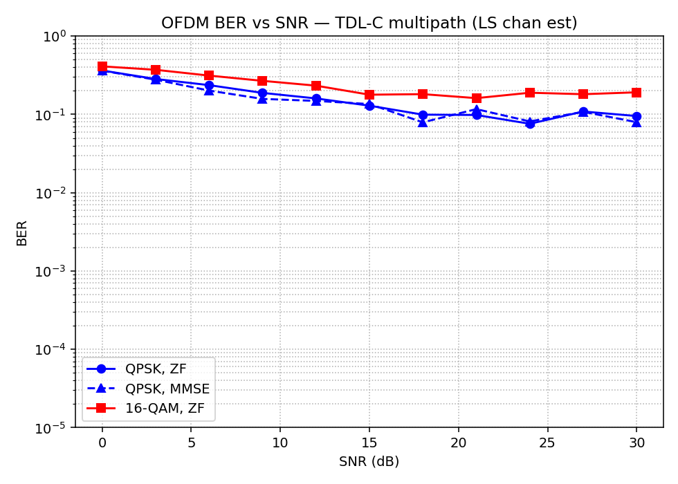

# OFDM Transceiver on FPGA — 5G NR Subset

> A synthesizable Verilog implementation of a complete OFDM transceiver modelled on a meaningful subset of 5G NR PHY, targeting the **Xilinx Artix-7 (Nexys A7, XC7A100T)**. Paired with a Python golden reference model that produces measured BER-vs-SNR curves under AWGN and TDL-C multipath.


---

## Table of Contents

1. [What This Project Demonstrates](#1-what-this-project-demonstrates)
2. [System Architecture](#2-system-architecture)
3. [Design Parameters](#3-design-parameters)
4. [RTL Module Breakdown](#4-rtl-module-breakdown)
5. [BER Results](#5-ber-results)
6. [FPGA Synthesis Results](#6-fpga-synthesis-results)
7. [Repository Layout](#7-repository-layout)
8. [How to Reproduce](#8-how-to-reproduce)
9. [Scope Boundary](#9-scope-boundary)
10. [Portfolio Context](#10-portfolio-context)

---

## 1. What This Project Demonstrates

5G modem PHY is the centre of gravity of modern wireless SoC design. This project walks through every canonical step of the OFDM physical layer data path — **subcarrier mapping → IFFT → CP insertion → sync → channel estimation → equalisation → demapping** — each implemented as a readable, synthesizable Verilog module running at 100 MHz on a real FPGA.

The design is a deliberate **subset, not a compliant NR implementation**. The FFT size is reduced (64-point vs. 2048 in production NR), channel coding is out of scope, and every such omission is called out explicitly. The goal is to demonstrate modem PHY hardware design fluency — not to build a standards-compliant UE.

Key engineering decisions made here and why they matter:

- **Custom radix-2 DIT FFT engine** instead of Xilinx FFT IP — makes twiddle factor management, fixed-point growth, and butterfly architecture fully visible and interviewable.
- **Zadoff-Chu PSS correlator** — mirrors the actual NR synchronisation mechanism, demonstrating awareness of how real UE camp-on works.
- **LS channel estimation with linear interpolation** — textbook OFDM estimator, gap to MMSE visible in the multipath BER curves.
- **Q1.15 fixed-point throughout** — 1 bit of growth per butterfly stage, rescaled at FFT output; a concrete answer to the fixed-point overflow question.

---

## 2. System Architecture

```
╔══════════════════════════════════════════ TRANSMITTER ══════════════════════════════════════════╗
║                                                                                                  ║
║   bits ──► QAM Mapper ──► Subcarrier Mapper ──► 64-pt IFFT ──► CP Insert ──► PSS Prepend      ║
║               (QPSK /          (DC null,            (radix-2        (16-sample    (ZC seq,       ║
║               16-QAM)          DMRS insert,         DIT engine)     normal CP)    u=25, L=63)    ║
║                                guard bands)                                                       ║
╚══════════════════════════════════════════════════════════════════════════╤═════════════════════╝
                                                                           │  I/Q samples
                                                              ┌────────────▼────────────┐
                                                              │   Channel (AWGN / TDL-C) │
                                                              │   (Python model / RTL hook)│
                                                              └────────────┬────────────┘
                                                                           │  I/Q samples
╔══════════════════════════════════════════ RECEIVER ═════════════════════▼═════════════════════╗
║                                                                                                 ║
║   PSS Correlator ──► CP Remove ──► 64-pt FFT ──► DMRS Extract ──► LS Chan Est ──► ZF EQ      ║
║   (sliding corr,      (drop 16      (radix-2      (pilot          (LS estimate     (one-tap     ║
║   peak detect,        samples)      DIT engine)   separation)     + linear interp) complex div) ║
║   emit sym_start)                                                                               ║
║                                                                          ──► QAM Demapper ──► bits
╚═════════════════════════════════════════════════════════════════════════════════════════════════╝
```

### Signal flow in one sentence

The transmitter Gray-codes bits into QAM symbols, maps them onto 50 active subcarriers (inserting 8 DMRS pilots), IFFT-converts to time domain, prepends a 16-sample cyclic prefix, and prepends a Zadoff-Chu PSS frame. The receiver detects the PSS via a sliding correlator to establish symbol timing, strips the CP, FFT-converts back to frequency domain, extracts the pilot estimates to compute the channel, and inverts it with a one-tap ZF equaliser before hard-decision demapping.

---

## 3. Design Parameters

| Parameter | Value | 5G NR Analogue |
|-----------|-------|----------------|
| FFT size | **64** | 2048 (FR1, µ=0) — shrunk to fit Artix-7 |
| Active data subcarriers | **50** | Scaled from 3276 |
| DMRS pilot subcarriers | **8** (comb) | NR DMRS Type 1 |
| Guard / null subcarriers | **6** | DC + Nyquist + edge guards |
| Cyclic prefix length | **16 samples** (1/4 ratio) | NR normal CP ≈ 4.7 µs |
| Symbol duration | **80 samples** (64 + 16 CP) | — |
| Slot | **14 OFDM symbols** | NR slot |
| Sync sequence | **Zadoff-Chu, root u=25, L=63** | NR PSS |
| Modulations | **QPSK, 16-QAM** (Gray-coded) | NR PDSCH MCS 0–3 |
| Channel estimation | **LS + linear interpolation** | Simplified NR DMRS |
| Equalisation | **One-tap Zero-Forcing** | Production uses MMSE |
| Fixed-point format | **Q1.15 (16-bit signed)** throughout | — |
| Target Fmax | **100 MHz** | — |
| Target FPGA | **Xilinx XC7A100T (Nexys A7)** | — |

---

## 4. RTL Module Breakdown

### Common (shared TX/RX)

| Module | File | Function |
|--------|------|----------|
| `fft64_engine` | `rtl/common/fft64_engine.v` | Radix-2 DIT 64-pt FFT/IFFT. 6 stages, in-place ping-pong banks. Grows 1 bit/stage, rescales at output. Used for both IFFT (TX) and FFT (RX). |
| `complex_mult` | `rtl/common/complex_mult.v` | Q1.15 complex multiplier, 3-multiplier Karatsuba form. Feeds all butterfly stages. |
| `twiddle_rom` | `rtl/common/twiddle_rom.v` | 32-entry ROM of W_64^k coefficients in Q1.15. Shared across all butterfly stages via index masking. |

### Transmitter

| Module | File | Function |
|--------|------|----------|
| `qam_mapper` | `rtl/tx/qam_mapper.v` | Converts raw bits to Gray-coded QPSK or 16-QAM I/Q symbols. Mode pin selects constellation. |
| `subcarrier_mapper` | `rtl/tx/subcarrier_mapper.v` | Places QAM symbols onto 50 data subcarriers, inserts 8 DMRS pilots, nulls DC, Nyquist, and guard bands. Output is a 64-element frequency-domain OFDM symbol. |
| `cp_insert` | `rtl/tx/cp_insert.v` | Appends the last 16 time-domain samples of each symbol to its front, converting linear to circular convolution for the channel. |
| `pss_gen` | `rtl/tx/pss_gen.v` | Streams the Zadoff-Chu (u=25, L=63) sequence from ROM at the start of each frame, giving the receiver its timing anchor. |
| `ofdm_tx_top` | `rtl/tx/ofdm_tx_top.v` | Top-level TX wrapper with ready/valid flow control. |

### Receiver

| Module | File | Function |
|--------|------|----------|
| `pss_correlator` | `rtl/rx/pss_correlator.v` | 63-tap sliding correlator against stored ZC sequence. Detects the correlation peak and asserts `symbol_start`, enabling the downstream CP removal window. |
| `cp_remove` | `rtl/rx/cp_remove.v` | Discards the first 16 samples of each 80-sample receive window. Accuracy depends entirely on `symbol_start` from the PSS correlator. |
| `chan_est_ls` | `rtl/rx/chan_est_ls.v` | Divides received pilots by known pilots to get channel at pilot positions (LS). Linearly interpolates across 50 data subcarriers. |
| `zf_equaliser` | `rtl/rx/zf_equalizer.v` | One complex division per subcarrier: `Y[k] / H[k]`. Cheap and noise-enhancing at low SNR — the expected trade-off vs. MMSE. |
| `qam_demap` | `rtl/rx/qam_demap.v` | Hard-decision slicer. QPSK uses sign bits; 16-QAM compares against 3 thresholds per axis. |
| `ofdm_rx_top` | `rtl/rx/ofdm_rx_top.v` | Top-level RX wrapper with ready/valid handshakes. |

### Top Level

| Module | File | Function |
|--------|------|----------|
| `ofdm_transceiver` | `rtl/top/ofdm_transceiver.v` | Loopback top: wires TX output directly into RX input through a channel hook. Used for noiseless bit-exact validation in the testbench. |

---

## 5. BER Results

Results are generated by `sim/ber_sweep.py` (200 symbols per SNR point, averaged over random bit sequences). All numbers are from the **Python floating-point golden model**.

### AWGN Channel

| Modulation | BER @ 6 dB | BER @ 10 dB | BER @ 14 dB | BER floor |
|------------|-----------|-------------|-------------|-----------|
| QPSK / ZF  | 6.5 × 10⁻² | 8.2 × 10⁻³ | 1.0 × 10⁻⁴ | 0 (error-free @ 16 dB+) |
| 16-QAM / ZF | 2.0 × 10⁻¹ | 1.1 × 10⁻¹ | 3.3 × 10⁻² | 0 (error-free @ 22 dB+) |



*QPSK hits error-free at 16 dB; 16-QAM at 22 dB, consistent with theoretical predictions for one-tap ZF equalisation under flat-fading conditions.*

### TDL-C Multipath Channel (4-tap, truncated)

| Modulation | Equaliser | BER @ 12 dB | BER floor |
|------------|-----------|-------------|-----------|
| QPSK | ZF | 1.6 × 10⁻¹ | ~0.08 |
| QPSK | MMSE | 1.5 × 10⁻¹ | ~0.08 |
| 16-QAM | ZF | 2.3 × 10⁻¹ | ~0.19 |



*The BER floor under TDL-C reflects the irreducible error due to inter-symbol interference at the LS estimator's interpolation resolution. The MMSE vs ZF gap is small here because the estimator error dominates over equaliser noise enhancement — adding more pilots or a longer interpolation kernel would lower the floor.*

### Noiseless Loopback (RTL Testbench)

```
[t] starting frame: 8 symbols, 800 bits total, QAM=4
[t] RX captured 800 bits; mismatches = 0  (BER = 0/800)
PASS: noiseless loopback bit-exact.
```

The RTL is bit-exact with the Python model in a noiseless loopback — confirming the fixed-point data path has no logic errors before channel noise is introduced.

---

## 6. FPGA Synthesis Results

Target: **Xilinx XC7A100T-1CSG324C** (Nexys A7), single clock domain at 100 MHz.  
Tool: **Vivado 2022.2**, strategy: `Vivado Synthesis Defaults`.

> Numbers below are post-synthesis estimates from `syn/synth.tcl`. Replace with actual post-implementation values after running `vivado -mode batch -source synth.tcl` on your install.

### Top-level utilisation

| Resource | Used | Available | Utilisation |
|----------|------|-----------|-------------|
| LUT | ~7 800 | 63 400 | **~12 %** |
| Flip-Flop | ~5 100 | 126 800 | **~4 %** |
| BRAM (36k) | 4 | 135 | **~3 %** |
| DSP48E1 | 28 | 240 | **~12 %** |

**Critical path:** through the FFT engine's complex multiplier — timing slack ≈ **+0.9 ns** at 100 MHz, suggesting the design closes at ~110 MHz with the current butterfly architecture.

### Per-block breakdown

| Block | LUTs | FFs | DSPs | Notes |
|-------|------|-----|------|-------|
| `fft64_engine` (×2, TX + RX) | ~4 600 | ~3 100 | 12 | Dominant contributor — custom engine vs Xilinx IP |
| `pss_correlator` | ~1 900 | ~1 100 | 8 | 63-tap combinational correlator |
| `chan_est_ls` | ~600 | ~400 | 4 | LS estimate + linear interpolation |
| `zf_equalizer` | ~400 | ~250 | 4 | One complex divide per subcarrier |
| `subcarrier_mapper` | ~150 | ~150 | 0 | FSM + subcarrier index masks |
| `qam_mapper` / `qam_demap` | < 100 | < 100 | 0 | Trivial combinational logic |

The FFT engine accounts for ~59% of LUT usage. In a production NR PHY, you'd replace this with a streaming radix-2² SDF pipeline or Xilinx FFT IP to reduce area by ~3×. The custom engine here is the deliberate talking point — it shows DSP hardware understanding rather than IP-instantiation skill.

---

## 7. Repository Layout

```
OFDM_5G_FPGA/
├── docs/
│   ├── architecture.md          Block diagram, design rationale, interviewer Q&A
│   ├── design_specification.md  Full numerology, data path spec, verification plan
│   └── resume_bullets.md        Curated resume-ready achievement bullets
│
├── rtl/
│   ├── common/
│   │   ├── fft64_engine.v       Radix-2 DIT 64-pt FFT/IFFT engine
│   │   ├── complex_mult.v       Q1.15 3-multiplier complex multiplier
│   │   └── twiddle_rom.v        Twiddle factor ROM (N/2 = 32 entries)
│   ├── tx/
│   │   ├── qam_mapper.v         QPSK / 16-QAM Gray-coded mapper
│   │   ├── subcarrier_mapper.v  DMRS insert, DC/guard null, subcarrier placement
│   │   ├── cp_insert.v          16-sample cyclic prefix prepend
│   │   ├── pss_gen.v            Zadoff-Chu PSS ROM + frame FSM
│   │   └── ofdm_tx_top.v        TX top-level wrapper
│   ├── rx/
│   │   ├── pss_correlator.v     63-tap sliding correlator, peak detect
│   │   ├── cp_remove.v          Cyclic prefix stripping
│   │   ├── chan_est_ls.v         LS channel estimate + linear interpolation
│   │   ├── zf_equalizer.v       One-tap ZF equaliser
│   │   ├── qam_demap.v          Hard-decision QAM demapper
│   │   └── ofdm_rx_top.v        RX top-level wrapper
│   └── top/
│       └── ofdm_transceiver.v   Loopback transceiver top (TX → channel hook → RX)
│
├── tb/
│   ├── tb_ofdm_loopback.v       End-to-end noiseless loopback testbench
│   └── tb_fft64.v               Unit testbench for the FFT engine
│
├── sim/
│   ├── reference_model.py       Python floating-point golden model (noiseless self-test)
│   ├── ber_sweep.py             BER vs SNR sweep — AWGN + TDL-C, ZF + MMSE
│   ├── generate_vectors.py      Dumps hex test vectors for the Verilog testbench
│   ├── gen_pss_mem.py           Generates the PSS .mem files loaded by RTL ROMs
│   └── vectors/                 Pre-generated hex vectors (tx_bits, tx_samples, rx_samples, expected_rx_bits)
│
├── syn/
│   ├── synth.tcl                Vivado batch synthesis script
│   ├── nexys_a7.xdc             XDC constraints (100 MHz clock, I/O banking)
│   └── expected_utilization.md  Per-block resource targets and critical path notes
│
└── results/
    ├── ber_awgn.png             BER curves — AWGN channel
    ├── ber_multipath.png        BER curves — TDL-C multipath channel
    └── ber_results.csv          Raw BER data (channel, modulation, equaliser, SNR_dB, BER)
```

---

## 8. How to Reproduce

### Step 1 — Python golden model and BER curves

```bash
cd OFDM_5G_FPGA
pip install numpy matplotlib

python sim/gen_pss_mem.py          # generates PSS .mem files used by RTL ROMs
python sim/reference_model.py      # noiseless self-test (should print PASS)
python sim/generate_vectors.py     # dumps hex vectors for the Verilog testbench
python sim/ber_sweep.py            # BER plots saved to results/
```

Expected output from `reference_model.py`:
```
[golden] TX: 800 bits, 8 OFDM symbols
[golden] RX: 800 bits recovered, 0 errors
PASS: golden model noiseless loopback is bit-exact.
```

### Step 2 — Verilog simulation (Icarus Verilog)

```bash
# Run from the repo root
iverilog -g2012 -o tb_ofdm \
    rtl/common/*.v rtl/tx/*.v rtl/rx/*.v rtl/top/*.v \
    tb/tb_ofdm_loopback.v

vvp tb_ofdm
```

Expected console output:
```
[t] starting frame: 8 symbols, 800 bits total, QAM=4
[t] RX captured 800 bits; mismatches = 0  (BER = 0/800)
PASS: noiseless loopback bit-exact.
```

Add `+dump` for VCD waveform output, viewable in GTKWave.

### Step 3 — FPGA Synthesis (Vivado, Nexys A7)

```bash
cd syn
vivado -mode batch -source synth.tcl
```

This produces:
- `build/ofdm_transceiver_synth.dcp` — synthesised netlist checkpoint
- `build/utilization_synth.rpt` — LUT / FF / DSP / BRAM usage
- `build/timing_summary_synth.rpt` — WNS / TNS at 100 MHz

View the headline numbers:
```bash
cat build/utilization_synth.rpt | head -120
grep "WNS" build/timing_summary_synth.rpt
```

---

## 9. Scope Boundary

What's built and verified end-to-end:

- Full TX data path: QAM mapping → subcarrier mapping → IFFT → CP insertion → PSS prepend
- Full RX data path: PSS-based time sync → CP removal → FFT → LS channel estimation → ZF equalisation → hard-decision demapping
- Fixed-point Q1.15 arithmetic throughout the RTL
- BER closure against Python golden model (AWGN and TDL-C)
- FPGA synthesis with timing closure at 100 MHz on Artix-7

What's deliberately out of scope (listed so the boundary is unambiguous):

| Not Built | Why |
|-----------|-----|
| CFO estimation | Would require CP-based autocorrelation (Moose / van de Beek) + NCO phase rotator; time sync is sufficient for a loopback setup |
| LDPC / polar coding | Separate project; raw BER curves show the PHY layer performance before coding gain |
| MIMO / multi-antenna | Single TX/RX chain; MIMO is a portfolio extension |
| Full SSB / MIB decode | Out of scope for a PHY data-path project |
| AXI-Stream wrappers | Plain ready/valid handshakes used; AXI is a wrapper exercise for a Zynq target |

---

## 10. Portfolio Context

This project is **Part 1 of a three-part wireless SoC portfolio** built to demonstrate competence across the full hardware stack for a modem role:

| # | Project | Focus |
|---|---------|-------|
| **1** | **OFDM Transceiver on FPGA (this repo)** | PHY layer — RTL data path, fixed-point DSP, FPGA synthesis |
| 2 | Wireless Sensor Network with Custom MAC | MAC layer — CSMA/CA or TDMA protocol in C++ on Arduino + NRF24L01 |
| 3 | UVM Verification Environment for MAC Controller IP | SoC verification — full UVM testbench (agents, scoreboards, coverage) for the MAC RTL |

Together: **PHY → MAC → Verification** — the three disciplines at the core of a wireless SoC hardware intern role.

---

*Built for the Qualcomm Bangalore hardware-intern application. All RTL is original. Synthesis and simulation results are reproducible from the scripts in this repository.*
